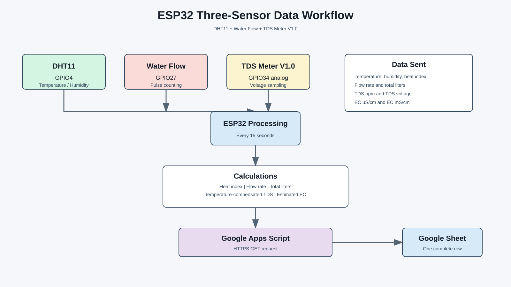
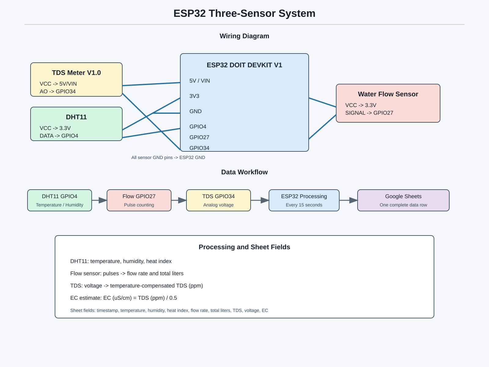

# 🌍 ESP32 Multi-Module Environmental Monitoring System

[](https://platformio.org/)
[](https://www.arduino.cc/)
[](https://www.espressif.com/)
[](https://thingsboard.io/)
[](./LICENSE)

An enterprise-grade, distributed IoT environmental monitoring platform powered by **ESP32**, **PlatformIO**, and **ThingsBoard Cloud**. The system consists of **3 independent, modular ESP32 nodes** tracking air quality, water purity, soil health, and ambient light in real time with hardware interrupts, median filtering, and dynamic temperature compensation.

---

## 🏛️ System Architecture

```text
                               +----------------------------------+
                               |     ThingsBoard Cloud IoT        |
                               |  https://things.digitalm.cloud   |
                               +-----------------+----------------+
                                                 |
                        +-------------------------+-------------------------+
                        | (HTTPS Telemetry)       | (HTTPS Telemetry)       | (HTTPS Telemetry)
                        v                         v                         v
             +---------------------+   +---------------------+   +---------------------+
             |  ESP32 Node 1       |   |  ESP32 Node 2       |   |  ESP32 Node 3       |
             |  Air Quality & Gas  |   |  Water & Flow       |   |  Light & Soil       |
             +----------+----------+   +----------+----------+   +----------+----------+
                        |                         |                         |
            +-----------+-----------+ +-----------+-----------+ +-----------+-----------+
            | DHT11 (Temp/Hum)      | | DHT11 (Temp/Hum)      | | DHT11 (Temp/Hum)      |
            | MQ-137 (Ammonia Gas)  | | Analog TDS Meter      | | BH1750 (Digital Lux)  |
            | FS200A (Flow Sensor)  | | Water Flow Sensor     | | Capacitive Soil v2.0  |
            | CCS811 (eCO2 & TVOC)  | +-----------------------+ +-----------------------+
            +-----------------------+
```

---

## 📊 Visual Workflows & Hardware Schematics

### 1. System Data & Telemetry Workflow


### 2. Sensor Wiring & Hardware Interfacing


---

## 📦 Modules Overview

### [💨 Module 1: Air Quality & Gas System](./Module_1_Air_Quality/)
* **ESP32 Board:** Module 1 (`COM10`)
* **Sensors:**
  * **DHT11:** Temperature (°C/°F), Humidity (%), Heat Index (°C) on `GPIO 4`
  * **MQ-137:** Ammonia ($NH_3$) Gas Sensor on `GPIO 33` (AO) & `GPIO 25` (DO) — *Calibrated to 0.0 ppm clean air baseline*
  * **FS200A:** Hall-effect flow sensor on `GPIO 27` (Hardware Interrupt)
  * **CCS811:** Equivalent $CO_2$ (eCO2) & Total Volatile Organic Compounds (TVOC) on `Wire1` (`GPIO 17 SDA`, `GPIO 16 SCL`)
* **Key Features:** Live DHT11 temperature and humidity compensation applied directly into CCS811 environmental baseline algorithms.
* **Documentation:** [Module 1 Pinout & Details](./Module_1_Air_Quality/PINOUT.md)

---

### [🌊 Module 2: Water Quality & Flow System](./Module_2_Water_Quality/)
* **ESP32 Board:** Module 2 (`COM11`)
* **Sensors:**
  * **DHT11:** Ambient Temperature & Humidity on `GPIO 4`
  * **Analog TDS Meter:** Total Dissolved Solids on `GPIO 34` (ADC1_CH6) — *Features 30-sample median filter & dynamic DHT11 temperature compensation*
  * **Water Flow Sensor (FS200A / YF-S201):** Hall-effect turbine on `GPIO 27` (Hardware Interrupt)
* **Key Features:** Real-time Flow Rate calculation in L/min, mL/sec, and cumulative Total Liters. Automatic water classification (*Pure RO*, *Drinking Water*, *Hard Water*, *Contaminated*).
* **Documentation:** [Module 2 Pinout & Details](./Module_2_Water_Quality/PINOUT.md)

---

### [🌿 Module 3: Light & Soil Moisture System](./Module_3_Light_Soil/)
* **ESP32 Board:** Module 3 (`COM9`)
* **Sensors:**
  * **DHT11:** Ambient Temperature & Humidity on `GPIO 4`
  * **BH1750 Digital Light Sensor:** Ambient illuminance (lux) on `Wire` (`GPIO 21 SDA`, `GPIO 22 SCL`) — *Calibrated with a $0.7308\times$ factor matching master reference instrument*
  * **Capacitive Soil Moisture Sensor v2.0:** Corrosion-free soil moisture on `GPIO 34` (ADC1_CH6)
* **Key Features:** 30-sample median filtering mapping soil moisture (0%–100%) with automated status classification (*Very Dry*, *Dry*, *Optimal*, *Wet*, *Submerged*).
* **Documentation:** [Module 3 Pinout & Details](./Module_3_Light_Soil/PINOUT.md)

---

## ☁️ ThingsBoard Cloud Integration

All 3 modules connect to Wi-Fi independently and stream telemetry payloads every 3 seconds via HTTPS:

| Module | Telemetry Keys Streamed |
|---|---|
| **Module 1** | `temperature`, `temperatureF`, `humidity`, `heatIndex`, `nh3PPM`, `nh3Level`, `mq137V`, `nh3Alert`, `flowPulses`, `flowHz`, `flowVolume`, `flowStatus`, `eCO2`, `eco2Status`, `tvoc`, `tvocStatus` |
| **Module 2** | `temperature`, `humidity`, `heatIndex`, `m2_temperature`, `m2_humidity`, `tdsPPM`, `tdsVoltage`, `waterQuality`, `flowRateLMin`, `flowRateMLSec`, `flowFrequencyHz`, `totalVolumeLiters`, `flowPulses`, `flowStatus` |
| **Module 3** | `temperature`, `humidity`, `heatIndex`, `m3_temperature`, `m3_humidity`, `lux`, `lightLevel`, `soilMoisture`, `moisture`, `soil_moisture`, `soilVoltage`, `soilRawADC`, `soilStatus` |

---

## 🚀 Getting Started

### Prerequisites
* [VS Code](https://code.visualstudio.com/) + [PlatformIO IDE Extension](https://platformio.org/)
* ESP32 DevKit V1 development boards
* Silicon Labs CP210x USB to UART Bridge VCP Drivers

### Flashing a Module
Each module is completely self-contained. Open any module in PlatformIO / VS Code:
```bash
# Example: Building and flashing Module 1
cd Module_1_Air_Quality
pio run --target upload
```

---

## 📜 License
This project is open-source and licensed under the [MIT License](./LICENSE).

---

## 👤 Author
* **Muhammad Hasnain** — [GitHub Profile](https://github.com/Muhammad-hasnain96)
