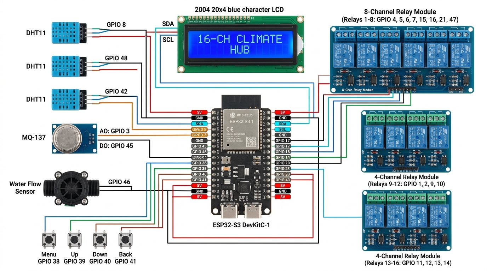
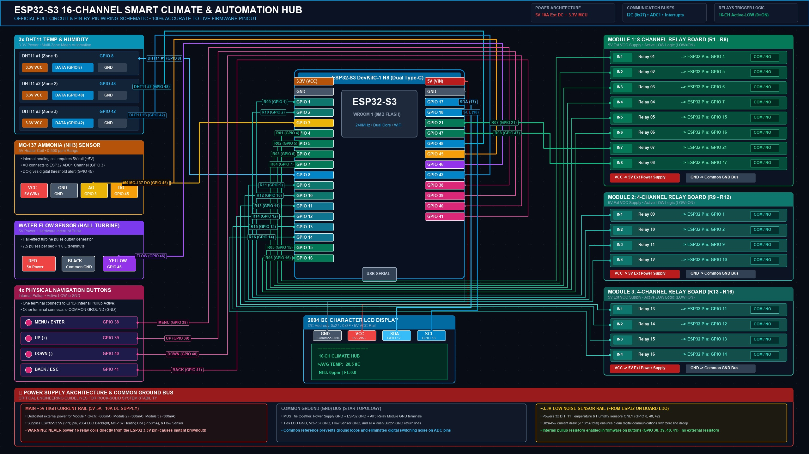

## 📸 1. Photorealistic Hardware Hookup Diagram (Real Components)

---

## 📐 2. Official Engineering Schematic & Architecture Diagram (2K QHD)

---

## 📌 Complete Pin-by-Pin Hardware Netlist (100% Firmware Verified)

### 1. 🔌 Relay Modules Control (Active-LOW: `0 = ON`, `1 = OFF`)

| Relay Channel | Physical Board | Relay Input Header | ESP32-S3 Pin | Firmware Constant | Trigger Logic | Output Terminal |
|---|---|---|---|---|---|---|
| **Relay 01** | Module 1 (8-Channel) | `IN1` | **`GPIO 4`** | `RELAY_PINS[0]` | Active-LOW (`LOW` = ON) | `COM1` / `NO1` |
| **Relay 02** | Module 1 (8-Channel) | `IN2` | **`GPIO 5`** | `RELAY_PINS[1]` | Active-LOW (`LOW` = ON) | `COM2` / `NO2` |
| **Relay 03** | Module 1 (8-Channel) | `IN3` | **`GPIO 6`** | `RELAY_PINS[2]` | Active-LOW (`LOW` = ON) | `COM3` / `NO3` |
| **Relay 04** | Module 1 (8-Channel) | `IN4` | **`GPIO 7`** | `RELAY_PINS[3]` | Active-LOW (`LOW` = ON) | `COM4` / `NO4` |
| **Relay 05** | Module 1 (8-Channel) | `IN5` | **`GPIO 15`** | `RELAY_PINS[4]` | Active-LOW (`LOW` = ON) | `COM5` / `NO5` |
| **Relay 06** | Module 1 (8-Channel) | `IN6` | **`GPIO 16`** | `RELAY_PINS[5]` | Active-LOW (`LOW` = ON) | `COM6` / `NO6` |
| **Relay 07** | Module 1 (8-Channel) | `IN7` | **`GPIO 21`** | `RELAY_PINS[6]` | Active-LOW (`LOW` = ON) | `COM7` / `NO7` |
| **Relay 08** | Module 1 (8-Channel) | `IN8` | **`GPIO 47`** | `RELAY_PINS[7]` | Active-LOW (`LOW` = ON) | `COM8` / `NO8` |
| **Relay 09** | Module 2 (4-Channel) | `IN1` | **`GPIO 1`** | `RELAY_PINS[8]` | Active-LOW (`LOW` = ON) | `COM1` / `NO1` |
| **Relay 10** | Module 2 (4-Channel) | `IN2` | **`GPIO 2`** | `RELAY_PINS[9]` | Active-LOW (`LOW` = ON) | `COM2` / `NO2` |
| **Relay 11** | Module 2 (4-Channel) | `IN3` | **`GPIO 9`** | `RELAY_PINS[10]` | Active-LOW (`LOW` = ON) | `COM3` / `NO3` |
| **Relay 12** | Module 2 (4-Channel) | `IN4` | **`GPIO 10`** | `RELAY_PINS[11]` | Active-LOW (`LOW` = ON) | `COM4` / `NO4` |
| **Relay 13** | Module 3 (4-Channel) | `IN1` | **`GPIO 11`** | `RELAY_PINS[12]` | Active-LOW (`LOW` = ON) | `COM1` / `NO1` |
| **Relay 14** | Module 3 (4-Channel) | `IN2` | **`GPIO 12`** | `RELAY_PINS[13]` | Active-LOW (`LOW` = ON) | `COM2` / `NO2` |
| **Relay 15** | Module 3 (4-Channel) | `IN3` | **`GPIO 13`** | `RELAY_PINS[14]` | Active-LOW (`LOW` = ON) | `COM3` / `NO3` |
| **Relay 16** | Module 3 (4-Channel) | `IN4` | **`GPIO 14`** | `RELAY_PINS[15]` | Active-LOW (`LOW` = ON) | `COM4` / `NO4` |

---

### 2. 🌡️ 3x DHT11 Temperature & Humidity Sensors (Multi-Zone)

| Sensor Instance | Sensor Pin | ESP32-S3 Connection | Voltage Rail | Purpose / Behavior |
|---|---|---|---|---|
| **DHT11 #1 (Zone 1)** | `DATA` | **`GPIO 8`** | `3.3V (VCC)` & `GND` | Primary temperature & humidity sampling zone |
| **DHT11 #2 (Zone 2)** | `DATA` | **`GPIO 48`** | `3.3V (VCC)` & `GND` | Second zone sampling sensor |
| **DHT11 #3 (Zone 3)** | `DATA` | **`GPIO 42`** | `3.3V (VCC)` & `GND` | Third zone sampling sensor |

> [!NOTE]
> All 3 DHT11 sensors are dynamically averaged: $\text{Avg Temp} = \frac{T_1 + T_2 + T_3}{3}$ and $\text{Avg Hum} = \frac{H_1 + H_2 + H_3}{3}$. If any sensor is unplugged or disconnected, the firmware gracefully isolates it and computes the mean from the remaining healthy sensors.

---

### 3. ☣️ MQ-137 Ammonia (NH3) Gas Sensor

| Sensor Pin | ESP32-S3 Connection | Net / Voltage Rail | Electrical Function / Notes |
|---|---|---|---|
| **`AO` (Analog)** | **`GPIO 3`** | `ADC1_CH2` (Analog Input) | Real-time Ammonia gas concentration (0.0 to 500.0 ppm) |
| **`DO` (Digital)** | **`GPIO 45`** | Digital Input | On-board potentiometer alarm threshold (`LOW` = Gas Alert) |
| **`VCC`** | **`5V (VIN)`** | External `+5V` Power Rail | Internal heating coil requires 5.0V (~150 mA) |
| **`GND`** | **`GND`** | Common Ground Bus | System Common Ground |

---

### 4. 🌊 Water Flow Sensor (Hall-Effect Turbine Pulse Counter)

| Wire Color | Sensor Terminal | ESP32-S3 Connection | Function / Operating Spec |
|---|---|---|---|
| **Yellow** | `Signal` | **`GPIO 46`** | High-speed hardware interrupt (`flowPulseISR`) |
| **Red** | `VCC (+)` | **`5V (VIN)`** | 5.0V Power Supply for internal Hall element |
| **Black** | `GND (-)` | **`GND`** | System Common Ground |

---

### 5. 📟 2004 Character LCD (I2C Backpack Module)

| LCD Backpack Pin | ESP32-S3 Pin | Bus Net | Description |
|---|---|---|---|
| **`SDA`** | **`GPIO 17`** | `I2C_SDA` | I2C Serial Data line (Internal 50 kHz clocking) |
| **`SCL`** | **`GPIO 18`** | `I2C_SCL` | I2C Serial Clock line |
| **`VCC`** | **`5V (VIN)`** | `+5V` | 5.0V supply for high-contrast character display & backlight |
| **`GND`** | **`GND`** | `GND` | System Common Ground |

---

### 6. 🔘 4 Physical Navigation Push Buttons (Momentary Switches)

| Button Function | ESP32-S3 Pin | Pin Mode | Switch Wiring |
|---|---|---|---|
| **`MENU / ENTER`** | **`GPIO 38`** | `INPUT_PULLUP` | Terminal 1 $\rightarrow$ **`GPIO 38`** • Terminal 2 $\rightarrow$ **`Common GND`** |
| **`UP (+)`** | **`GPIO 39`** | `INPUT_PULLUP` | Terminal 1 $\rightarrow$ **`GPIO 39`** • Terminal 2 $\rightarrow$ **`Common GND`** |
| **`DOWN (-)`** | **`GPIO 40`** | `INPUT_PULLUP` | Terminal 1 $\rightarrow$ **`GPIO 40`** • Terminal 2 $\rightarrow$ **`Common GND`** |
| **`BACK / ESC`** | **`GPIO 41`** | `INPUT_PULLUP` | Terminal 1 $\rightarrow$ **`GPIO 41`** • Terminal 2 $\rightarrow$ **`Common GND`** |

> [!TIP]
> Internal pullup resistors (`INPUT_PULLUP`) are active inside the ESP32-S3. No external resistors or breadboards are required—connect directly between the GPIO and Ground.
